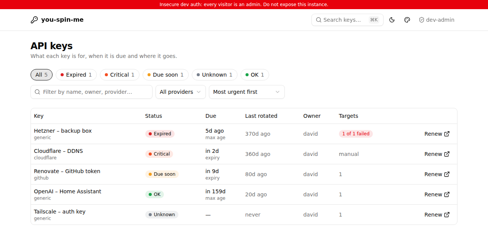
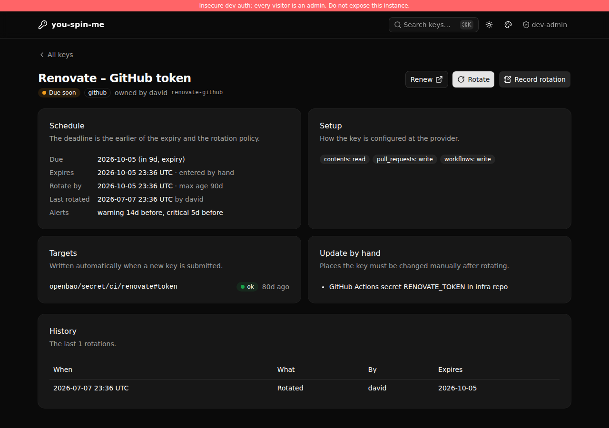
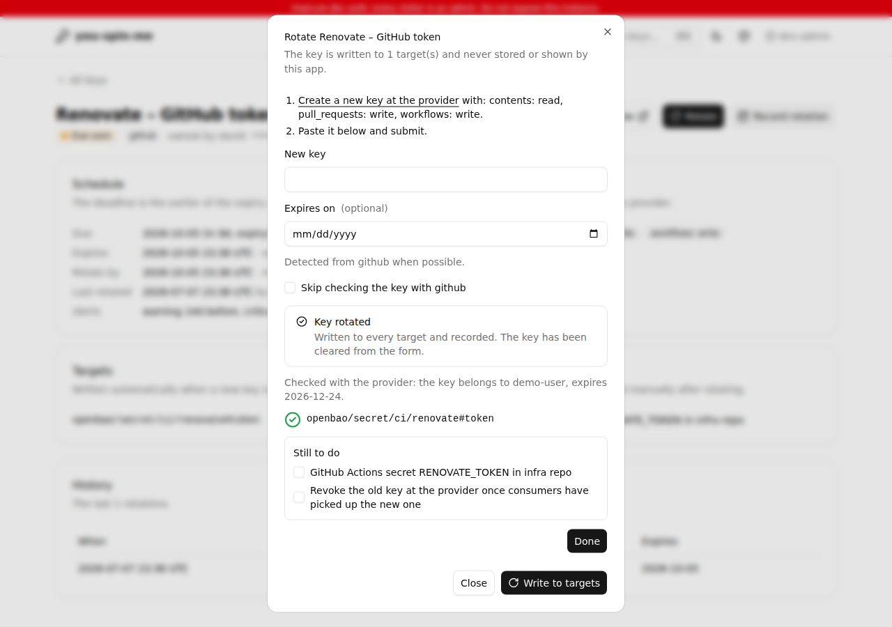

# you-spin-me

A self-hosted, Kubernetes-native inventory of external API keys. For each key
it tracks how the key is set up, when it expires, where to renew it and where it
has to be updated. It exports Prometheus metrics, so expiry alerts arrive
through Alertmanager like everything else.

It never stores keys. When you rotate one, the new key is written once to the
configured OpenBao paths and then forgotten. The app's OpenBao policy cannot read
it back, and workloads get it from OpenBao through the External Secrets
Operator.



| Key detail (dark mode) | Rotating a key |
|---|---|
|  |  |

## How it works

```
git (ApiKey YAML) ──Argo CD / Flux──▶ ApiKey CRs ◀──watch / write status── you-spin-me ──▶ /metrics ──▶ Prometheus ──▶ Alertmanager
                                                                                │
                                                                   new key, once│ PATCH (create + patch only)
                                                                                ▼
                                                     workloads ◀── Kubernetes Secret ◀── ESO ◀── OpenBao KV v2
```

- **Inventory in git.** Each key is an `ApiKey` resource: provider, owner,
  renew URL, permissions, rotation policy, OpenBao targets and places to update
  by hand.
- **State in `.status`.** Last rotation, expiry, target results and a short
  history are written by the app through the status subresource. GitOps tools
  ignore it.
- **Deadline.** The deadline is the earlier of the key's expiry and
  `lastRotated + maxAge`. Keys that never expire still get a deadline from the
  rotation policy.
- **Rotation.** Open the renew link, create the key, paste it into the rotate
  dialog. The app can check it with the provider (GitHub, Cloudflare), which
  also detects the expiry. It then writes the key to every target, records the
  rotation, and lists what is left to do by hand.
- **Alerts.** Warning at 14 days, critical at 5 days (both overridable per key),
  plus expired, unknown state and failed target write.

A full design write-up is in [docs/PLAN.md](docs/PLAN.md).

## Try it

```sh
cargo run -- --demo        # http://localhost:8080, sample data, no login
```

Demo mode keeps everything in memory and treats every visitor as an admin.
Press <kbd>⌘K</kbd> or <kbd>/</kbd> to search.

## Install

### 1. OpenBao

Enable the Kubernetes auth method and create a write-only policy and role:

```sh
BAO_ADDR=https://openbao.example.com BAO_TOKEN=... deploy/examples/openbao-setup.sh
```

The policy in [`deploy/examples/openbao-policy.hcl`](deploy/examples/openbao-policy.hcl)
grants only `create` and `patch` on the paths your keys use. **The policy is the
security boundary.** Anyone who can merge an `ApiKey` can point it at any path
the policy allows, and the app would overwrite the key there.

### 2. Helm

```sh
helm install you-spin-me deploy/helm/you-spin-me -n you-spin-me --create-namespace \
  --set publicUrl=https://keys.example.com \
  --set oidc.issuer=https://auth.example.com/application/o/you-spin-me/ \
  --set oidc.clientSecret.existingSecret=you-spin-me-oidc \
  --set openbao.addr=https://openbao.openbao.svc:8200 \
  --set serviceMonitor.enabled=true --set prometheusRule.enabled=true \
  --set grafanaDashboard.enabled=true
```

Options are documented in [`values.yaml`](deploy/helm/you-spin-me/values.yaml).
The chart installs the CRD, a single-replica Deployment and a Role that can read
`ApiKey`s, write their status and create Events. It gets no access to Secrets.
The chart also mounts a ServiceAccount token with audience `openbao` for
OpenBao's Kubernetes auth.

OIDC: register a confidential client with redirect URI
`<publicUrl>/auth/callback`. Admins are users whose ID token claim `groups`
contains `you-spin-me-admins` (see `oidc.adminClaim` / `oidc.adminValue`;
dotted paths such as `realm_access.roles` work). Everyone else who can log in
gets read-only access.

### 3. Keys

```yaml
apiVersion: you-spin-me.prdv.cloud/v1alpha1
kind: ApiKey
metadata:
  name: renovate-github
  namespace: you-spin-me
spec:
  displayName: Renovate – GitHub token
  provider: github             # github | cloudflare | generic (no probe)
  owner: david
  renewUrl: https://github.com/settings/personal-access-tokens
  setup:
    permissions: ["contents: read", "pull_requests: write"]
    notes: Fine-grained PAT, all repos of the org.
  rotation:
    maxAge: 90d                # optional; s, m, h, d or w
    warnBefore: 14d            # optional per-key overrides
    criticalBefore: 5d
  targets:
    - openbao: { mount: secret, path: ci/renovate, key: token }
  consumers:
    - GitHub Actions secret RENOVATE_TOKEN in PedDavid/infra
```

More in [`deploy/examples`](deploy/examples), including an
[ExternalSecret](deploy/examples/externalsecret-renovate.yaml) that delivers a
rotated key to a workload. For existing keys, or after a cluster rebuild, use
**Record rotation** in the UI to set the dates without submitting a key.

```sh
kubectl -n you-spin-me get apikeys
NAME              PROVIDER   OWNER   EXPIRES                ROTATED   VALID
renovate-github   github     david   2026-12-19T00:00:00Z   3d        True
```

### On-demand keys

Some keys are only created for a one-off task and deleted right after, so
they are never stored and never expire. They can still be listed, with the
create link, the permissions to pick and notes:

```yaml
spec:
  lifecycle: onDemand          # default: managed
  renewUrl: https://github.com/settings/personal-access-tokens/new
  setup:
    permissions: ["contents: write"]
    notes: Create for the migration, delete right after.
```

- **No deadline, no alerts.** These keys show as *On demand* and only export
  `youspinme_apikey_info` and `youspinme_apikey_last_used_timestamp_seconds`.
- **Create instead of Renew or Rotate.** Clicking **Create** opens the
  provider's page. It also records who opened it and when, in the key's
  status, its history and a Kubernetes Event. The app cannot see whether a
  token was actually created.
- **Validation.** `targets` and `rotation.maxAge` are rejected by the `Valid`
  condition, since both contradict "never stored".

## Security model

- **Write-only.** The OpenBao policy allows `create` and `patch` only: existing
  secrets are updated with `PATCH`, which keeps other keys at the path, and new
  paths are created with `POST`. The app never reads `data/` or `metadata/`.
  The integration test checks this against a real OpenBao server.
- **One request.** A submitted key lives for a single request, in a
  `SecretString` that is zeroed on drop and cannot be printed. It is never
  logged. A test sends a key through the whole HTTP path with TRACE logging and
  asserts it appears nowhere but in the OpenBao request. Copies made by the
  HTTP stack (request body buffers, the outgoing body) are not zeroed, so
  zeroing is best effort.
- **Authentication and requests.**
  - OIDC authorization code flow with PKCE and nonce.
  - Sessions are encrypted cookies (`HttpOnly`, `SameSite=Lax`, and `Secure`
    when the public URL is https).
  - POSTs require a same-origin `Origin` header and a CSRF token.
  - Responses carry a strict CSP (`script-src 'self'`, no inline scripts or
    eval) and `Cache-Control: no-store`.
- **Step-up.** With `--step-up-max-age 15m`, rotating a key or recording a
  rotation needs a login from the last 15 minutes. Otherwise the rotate dialog
  links to a forced re-login, and recording redirects to one.
  The login time comes from the ID token's `auth_time` claim; a provider
  that omits it (or ignores `prompt=login`) cannot satisfy step-up.
- **Probes.** Provider hosts are fixed in code, so a spec cannot send a key
  anywhere else.

## Metrics

Served on `:9090/metrics`, together with `/healthz` and `/readyz`. Per-key
metrics carry the labels `namespace`, `name`, `provider` and `owner`.

| Metric | Meaning |
|---|---|
| `youspinme_apikey_deadline_timestamp_seconds` | Earlier of expiry and rotate-by; alert on this |
| `youspinme_apikey_expiry_timestamp_seconds` | Probed or manual expiry |
| `youspinme_apikey_rotate_by_timestamp_seconds` | `lastRotated + maxAge` |
| `youspinme_apikey_last_rotated_timestamp_seconds` | |
| `youspinme_apikey_last_used_timestamp_seconds` | On-demand keys: when the create page was last opened |
| `youspinme_apikey_warn_before_seconds`, `…_critical_before_seconds` | Per-key thresholds |
| `youspinme_apikey_state_known` | 0 when there is no deadline at all |
| `youspinme_apikey_target_healthy{target}` | Result of the last write per target |
| `youspinme_apikey_info{lifecycle, display_name, renew_url}` | Metadata for joins |
| `youspinme_rotations_total{result}` | ok, partial, failed, rejected, recorded |
| `youspinme_probe_requests_total{provider,result}` | |

The alert rules are in
[`files/alerts.yaml`](deploy/helm/you-spin-me/files/alerts.yaml). They were
checked with `promtool` and against a live Prometheus.

## Configuration

Every flag can also be set with an environment variable; see
`you-spin-me --help` for the full list.

| Flag / env | Default | |
|---|---|---|
| `--public-url` / `YSM_PUBLIC_URL` | `http://localhost:8080` | OIDC redirect, Origin check, links |
| `--namespace` / `YSM_NAMESPACE` | pod namespace | Where `ApiKey`s live |
| `--warn-before`, `--critical-before` | `14d`, `5d` | Default thresholds |
| `--allowed-paths` / `YSM_ALLOWED_PATHS` | `*` | OpenBao path globs for early validation |
| `--oidc-issuer`, `--oidc-client-id`, `--oidc-client-secret-file` | | |
| `--admin-claim`, `--admin-value` | `groups`, `you-spin-me-admins` | |
| `--session-ttl`, `--step-up-max-age` | `8h`, off | |
| `--cookie-key-file` | random per process | ≥ 64 bytes, raw or base64 |
| `--openbao-addr`, `--openbao-role`, `--openbao-auth-mount` | —, `you-spin-me`, `kubernetes` | |
| `--openbao-jwt-file` | `/var/run/secrets/openbao/token` | Projected token for Kubernetes auth |
| `--openbao-token-file`, `--openbao-ca-file` | | Static token (dev), extra CA |
| `--demo`, `--insecure-dev-auth` | off | Development only |

## Development

Stack:
- **Backend:** Rust with axum and kube-rs.
- **Pages:** rendered on the server with askama templates.
- **UI:** Tailwind v4 with vendored [Basecoat](https://basecoatui.com)
  (shadcn/ui without React) and htmx. No Node.js is needed at runtime or to
  build the binary.

```sh
make check        # fmt, clippy, tests (what CI runs)
make css          # rebuild assets/dist/app.css (Tailwind standalone CLI)
make crd          # regenerate the CRD from the Rust types
make helm-lint

# Against a real OpenBao:
docker run -d -p 8200:8200 -e BAO_DEV_ROOT_TOKEN_ID=root openbao/openbao:2.4.1
YSM_TEST_OPENBAO_ADDR=http://127.0.0.1:8200 YSM_TEST_OPENBAO_ROOT_TOKEN=root cargo test --test openbao
```

## Limitations

- **Single replica.** The UI cache and controller run in one process.
- **Rotation state can be lost.** It lives in `.status`, which is not in git.
  After a cluster rebuild, keys show *unknown* (and alert) until their dates are
  recorded again.
- **Cloudflare account-owned tokens** can't be checked with the user endpoint,
  and **GitHub tokens without access to `/user`** (such as GitHub App tokens)
  get a 403 that can't be told apart from rate limiting. Tick *skip
  verification* for those.
- **GitHub expiry** is only detected for personal access tokens.
